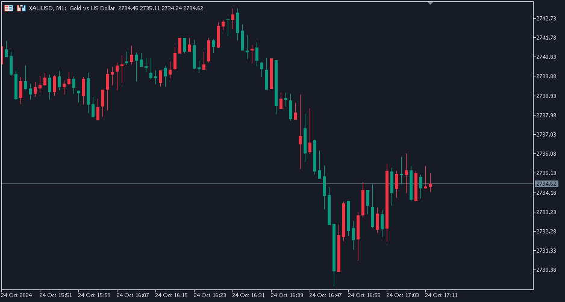

# UDP Tick Data Collector

這是一個用於收集和顯示來自兩個不同 UDP 來源的行情數據的 Python 程序。該程序通過接收來自兩個端口的數據，並將其在圖表中動態顯示，還會定期將數據寫入到 `.log` 文件中。
比對不同的報價ASK 出現極端行情的時候 可以極短的時間內進行交易

## 動態展示

## 對應的當時 M1 蠟燭圖

圖片中有出現波動 但因為ASK 和 Bid之間 尚未計算
實際需要更大的價差或是時間差才能進行交易

##注意
- 需要搭配MT5使用特定EA進行UDP發送 本程式才能取得資料
- 你也可以嘗試自己建置發送的UDP程式 採用標準socket

## 功能介紹
- 接收兩個不同端口的數據，並動態顯示在圖表中。
- 支持實時顯示數據，並將最新數據寫入 `.log` 文件。
- 圖表會根據接收到的數據自動調整 `y` 軸的範圍。
- 支持定時批量寫入數據以減少硬碟的消耗。

## 如何運行
1. 設置 UDP 伺服器端口號（默認 8082 和 8092）。
2. 運行 Python 程序，觀察實時的行情數據。
3. 所有數據將被記錄在 `data_log.txt` 文件中。

## 依賴項
- Python 3.x
- Matplotlib
